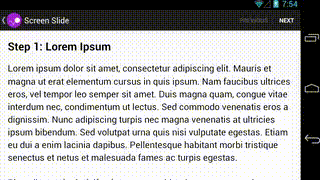

# ViewPager와 ViewPager2로 프래그먼트 간 슬라이드

<!--Table of Contents-->

- ViewPager
- ViewPager2
- ViewPager에서 ViewPager2로 이전

<!-- 어떤 질문을 대답할 수 있어야 하는지-->

## You can answer

- ViewPager를 이용해서 화면 슬라이드를 실행하는 방법
- ViewPager2를 이용해서 화면 슬라이드를 실행하는 방법

<!--Contents-->

---

## ViewPager



1. 프래그먼트 콘텐츠에 사용할 레이아웃 파일

```
<!-- fragment_screen_slide_page.xml -->
<ScrollView xmlns:android="http://schemas.android.com/apk/res/android"
    android:id="@+id/content"
    android:layout_width="match_parent"
    android:layout_height="match_parent" >

    <TextView style="?android:textAppearanceMedium"
        android:padding="16dp"
        android:lineSpacingMultiplier="1.2"
        android:layout_width="match_parent"
        android:layout_height="wrap_content"
        android:text="@string/lorem_ipsum" />
</ScrollView>
```

2. Fragment 만들기

 ```kotlin
import android.support.v4.app.Fragment

class ScreenSlidePageFragment : Fragment() {

    override fun onCreateView(
        inflater: LayoutInflater,
        container: ViewGroup?,
        savedInstanceState: Bundle?
    ): View = inflater.inflate(R.layout.fragment_screen_slide_page, container, false)
}
```

3. ViewPager 추가

 ```
<!-- activity_screen_slide.xml -->
<android.support.v4.view.ViewPager
    xmlns:android="http://schemas.android.com/apk/res/android"
    android:id="@+id/pager"
    android:layout_width="match_parent"
    android:layout_height="match_parent" />
```

Activity 만들기

- FragmentStatePagerAdapter 추상 클래스를 확장하는 클래스를 만들고 getItem(), getCount() 메서드 구현

```kotlin
 import android.support.v4.app.Fragment
import android.support.v4.app.FragmentManager

...
/**
 * The number of pages (wizard steps) to show in this demo.
 */
private const val NUM_PAGES = 5

class ScreenSlidePagerActivity : FragmentActivity() {

    /**
     * The pager widget, which handles animation and allows swiping horizontally to access previous
     * and next wizard steps.
     */
    private lateinit var mPager: ViewPager

    override fun onCreate(savedInstanceState: Bundle?) {
        super.onCreate(savedInstanceState)
        setContentView(R.layout.activity_screen_slide)

        // Instantiate a ViewPager and a PagerAdapter.
        mPager = findViewById(R.id.pager)

        // The pager adapter, which provides the pages to the view pager widget.
        val pagerAdapter = ScreenSlidePagerAdapter(supportFragmentManager)
        mPager.adapter = pagerAdapter
    }

    override fun onBackPressed() {
        if (mPager.currentItem == 0) {
            // If the user is currently looking at the first step, allow the system to handle the
            // Back button. This calls finish() on this activity and pops the back stack.
            super.onBackPressed()
        } else {
            // Otherwise, select the previous step.
            mPager.currentItem = mPager.currentItem - 1
        }
    }

    /**
     * A simple pager adapter that represents 5 ScreenSlidePageFragment objects, in
     * sequence.
     */
    private inner class ScreenSlidePagerAdapter(fm: FragmentManager) : FragmentStatePagerAdapter(fm) {
        override fun getCount(): Int = NUM_PAGES

        override fun getItem(position: Int): Fragment = ScreenSlidePageFragment()
    }
}
```

4. 애니메이션 맞춤 설정

- 기존 애니메이션과 다른 애니메이션 표시를 위해 ViewPager.PageTransformer 인터페이스를 구현하여 뷰페이저에 제공함.
- 화면의 페이지 위치에 따라 setAlpha(), setTranslationX() 또는 setScaleY()와 같은 메서드로 페이지 속성을 설정하여 맞춤 슬라이드 애니메이션을 만들 수 있음.

```kotlin
val mPager: ViewPager = findViewById(R.id.pager)
...
mPager.setPageTransformer(true, ZoomOutPageTransformer())
```

페이지 축소 변환기  


```kotlin
private const val MIN_SCALE = 0.85f
private const val MIN_ALPHA = 0.5f

class ZoomOutPageTransformer : ViewPager.PageTransformer {

    override fun transformPage(view: View, position: Float) {
        view.apply {
            val pageWidth = width
            val pageHeight = height
            when {
                position < -1 -> { // [-Infinity,-1)
                    // This page is way off-screen to the left.
                    alpha = 0f
                }
                position <= 1 -> { // [-1,1]
                    // Modify the default slide transition to shrink the page as well
                    val scaleFactor = Math.max(MIN_SCALE, 1 - Math.abs(position))
                    val vertMargin = pageHeight * (1 - scaleFactor) / 2
                    val horzMargin = pageWidth * (1 - scaleFactor) / 2
                    translationX = if (position < 0) {
                        horzMargin - vertMargin / 2
                    } else {
                        horzMargin + vertMargin / 2
                    }

                    // Scale the page down (between MIN_SCALE and 1)
                    scaleX = scaleFactor
                    scaleY = scaleFactor

                    // Fade the page relative to its size.
                    alpha = (MIN_ALPHA +
                            (((scaleFactor - MIN_SCALE) / (1 - MIN_SCALE)) * (1 - MIN_ALPHA)))
                }
                else -> { // (1,+Infinity]
                    // This page is way off-screen to the right.
                    alpha = 0f
                }
            }
        }
    }
}
```

## ViewPager2

위의 실행 단계 '3.ViewPager 추가' 에서 ViewPager를 ViewPager2로 변경해서 추가!

```
<!-- activity_screen_slide.xml -->
    <androidx.viewpager2.widget.ViewPager2
        xmlns:android="http://schemas.android.com/apk/res/android"
        android:id="@+id/pager"
        android:layout_width="match_parent"
        android:layout_height="match_parent" />
```

Activity 만들기

- ViewPager에서는 FragmentStatePagerAdapter를 만들었지만 ViewPager2에서는 FragmentStateAdapter를 만듦.
```kotlin
import androidx.fragment.app.Fragment
import androidx.fragment.app.FragmentActivity

...
/**

 * The number of pages (wizard steps) to show in this demo.
 */
private const val NUM_PAGES = 5

class ScreenSlidePagerActivity : FragmentActivity() {

  /**
   * The pager widget, which handles animation and allows swiping horizontally to access previous
   * and next wizard steps.
   */
  private lateinit var viewPager: ViewPager2

  override fun onCreate(savedInstanceState: Bundle?) {
    super.onCreate(savedInstanceState)
    setContentView(R.layout.activity_screen_slide)

    // Instantiate a ViewPager2 and a PagerAdapter.
    viewPager = findViewById(R.id.pager)

    // The pager adapter, which provides the pages to the view pager widget.
    val pagerAdapter = ScreenSlidePagerAdapter(this)
    viewPager.adapter = pagerAdapter
  }

  override fun onBackPressed() {
    if (viewPager.currentItem == 0) {
      // If the user is currently looking at the first step, allow the system to handle the
      // Back button. This calls finish() on this activity and pops the back stack.
      super.onBackPressed()
    } else {
      // Otherwise, select the previous step.
      viewPager.currentItem = viewPager.currentItem - 1
    }
  }

  /**
   * A simple pager adapter that represents 5 ScreenSlidePageFragment objects, in
   * sequence.
   */
  private inner class ScreenSlidePagerAdapter(fa: FragmentActivity) : FragmentStateAdapter(fa) {
    override fun getItemCount(): Int = NUM_PAGES

    override fun createFragment(position: Int): Fragment = ScreenSlidePageFragment()
  }
}

```
이외에는 동일함.

## ViewPager에서 ViewPager2로 이전
ViewPager2는 ViewPager 라이브러리의 개선된 버전으로, 향상된 기능을 제공하며 ViewPager 사용 시 발생하는 일반적인 문제를 해결함
- ViewPager2를 사용하면 좋은 이점
  - 세로 방향 지원  
    ViewPager에서는 가로 페이징만 지원함.
  - 오른쪽에서 왼쪽 지원(RTL 페이징)
  ```
  <androidx.viewpager2.widget.ViewPager2
  xmlns:android="http://schemas.android.com/apk/res/android"
  android:id="@+id/pager"
  android:layoutDirection="rtl" />
  ```
  - 수정 가능한 프래그먼트 컬렉션  
  ViewPager2에서는 수정 가능한 프래그먼트 컬렉션을 통해 페이징 지원, 기본 컬렉션이 변경되면 notifyDatasetChanged()를 호출하여 UI 업데이트
  - DiffUtil  
  ViewPager2는 RecyclerView를 기반으로 빌드되므로 DiffUtil 클래스 엑세스 가능하며
    기본적으로 RecyclerView 클래스의 Dataset 변경 애니메이션을 활용할 수 있음.

- ViewPager 어댑터 클래스를 ViewPager2와 함께 사용할 수 있도록 변환하려면 다음과 같이 변경하면 됨.
    1. 슈퍼클래스는 뷰를 통해 페이징하는 경우 RecyclerView.Adapter로, 프래그먼트를 통해 페이징하는 경우 FragmentStateAdapter로 변경.
    2. 프래그먼트 기반 어댑터 클래스에서는 생성자 매개변수를 변경.
    3. getCount()가 아닌 getItemCount()를 재정의함.
    4. 프래그먼트 기반 어댑터 클래스에서는 getItem()가 아닌 createFragment()를 재정의함.        
---

## Reference

- [Android Developers - ViewPager로 프래그먼트 간 슬라이드](https://developer.android.com/training/animation/screen-slide)
- [Android Developers - ViewPager2로 프래그먼트 간 슬라이드](https://developer.android.com/training/animation/screen-slide-2)
- [Android Developers - ViewPager에서 ViewPager2로 이전](https://developer.android.com/training/animation/vp2-migration)