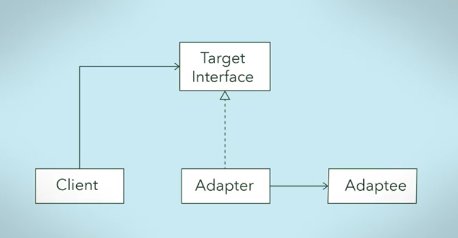

# 어댑터 패턴(Adapter Pattern)

- 어댑터 패턴이란?
- 어댑터 패턴의 장단점
- 어댑터 패턴의 구현

## You Can Answer

- 어댑터 패턴이란 무엇인가요?
- 어댑터 패턴의 장단점은 무엇인가요?
- 어댑터 패턴은 언제 사용하나요?

## 어댑터 패턴이란?

어댑터 패턴은 이름대로 어댑터처럼 사용되는 패턴이다. 220V 를 사용하는 한국에서 쓰던 기기들을, 어댑터를 사용하면 110V 를 쓰는곳에 가서도 그대로 쓸 수 있다. 이처럼, 호환성이 없는 인터페이스 때문에 함께 동작할 수 없는 클래스들이 함께 작동하도록 해주는 패턴이 어댑터 패턴이다. 이를 위해 어댑터 역할을 하는 클래스를 새로 만들어야 한다.



**Client**
써드파티 라이브러리나 외부시스템을 사용하려는 쪽이다.

**Adaptee**
써드파티 라이브러리나 외부시스템을 의미한다.

**Target Interface**
Adapter 가 구현(implements) 하는 인터페이스이다. 클라이언트는 Target Interface 를 통해 Adaptee 인 써드파티 라이브러리를 사용하게 된다.

**Adapter**
Client 와 Adaptee 중간에서 호환성이 없는 둘을 연결시켜주는 역할을 담당한다. Target Interface 를 구현하며, 클라이언트는 Target Interface 를 통해 어댑터에 요청을 보낸다. 어댑터는 클라이언트의 요청을 Adaptee 가 이해할 수 있는 방법으로 전달하고, 처리는 Adaptee 에서 이루어진다.

## 장단점

- 장점

  - Adapter 패턴의 가장 큰 장점을 기존 코드를 변경하지 않아도 된다.
  - 기존 코드를 변경하지 않기 때문에 클래스 재활용성을 증가시킬 수 있다.

- 단점
  - 구성요소를 위해 클래스를 증가시켜야 하기 때문에 복잡도가 증가할 수 있다.
  - 클래스 Adapter 의 경우 상속을 사용하기 때문에 유연하지 않다.
  - 반명 객체 Adapter 의 경우는 대부분의 코드를 다시 작성해야 하기 때문에 효율적이지 못하다.

## 구현 예시

```java
public interface Duck {
  public void quack();
  public void fly();
}
```

```java
public interface Turkey {
  public void gobble();
  public void fly();
}
```

```java
public class MallardDuck implements Duck {

  @Override
  public void quack() {
    System.out.println("Quck quack");
  }

  @Override
  public void fly() {
    System.out.println("I Can't Fly");
  }
}
```

```java
public class WildTurkey implements Turkey {

  @Override
  public void gobble() {
    System.out.println("Gobble gobble");
  }

  @Override
  public void fly() {
    System.out.println("I'm flying a short distance");
  }
}
```

```java
public class TurkeyAdapter implements Duck {

  Turkey turkey;

  public TurkeyAdapter(Turkey turkey) {
    this.turkey = turkey;
  }

  @Override
  public void quack() {
    turkey.gobble();
  }

  @Override
  public void fly() {
    turkey.fly();
  }
}
```

```java
public class DuckTest {

  public static void main(String[] args) {

    MallardDuck duck = new MallardDuck();
    WildTurkey turkey = new WildTurkey();
    Duck turkeyAdapter = new TurkeyAdapter(turkey);

    System.out.println("The turkey says...");
    turkey.gobble();
    turkey.fly();

    System.out.println("The Duck says...");
    duck.quack();
    duck.fly();

    System.out.println("The TurkeyAdapter says...");
    turkeyAdapter.quack();
    turkeyAdapter.fly();
  }
}
```

```
The turkey says...
Gobble gobble
I'm flying a short distance
The Duck says...
Quck quack
I Can't Fly
The TurkeyAdapter says...
Gobble gobble
I'm flying a short distance
```


## Reference
- [어댑터 패턴(adapter pattern)](https://jusungpark.tistory.com/22)
- [[Design Pattern] Adapter 패턴](https://kscory.com/dev/design-pattern/adapter)
