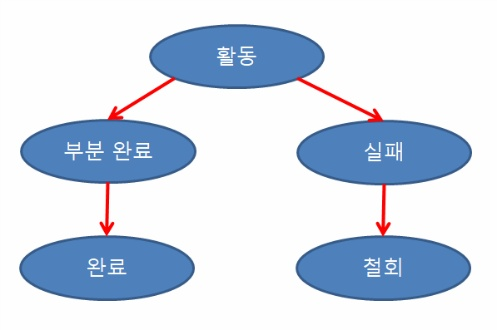

# 트랜잭션(Transaction)
<!--Table of Contents-->
- 트랜잭션의 정의
- 트랜잭션의 특징
- 트랜잭션의 성질
- 트랜잭션 연산 및 상태

## You Can Answer
- 트랜잭션이란?
- 트랜잭션의 성질을 말해보거라.
-----------------------

## 트랜잭션의 정의
- 트랜잭션은 데이터베이스의 상태를 변환시키는 하나의 논리적 기능을 수행하기 위한 작업의 단위 또는 한꺼번에 모두 수행되어야 할 일련의 연산들을 의미한다.

 

## 트랜잭션의 특징
- 트랜잭션은 데이터베이스 시스템에서 병행 제어 및 회복 작업 시 처리되는 작업의 논리적 단위이다.
- 사용자가 시스템에 대한 서비스 요구 시 시스템이 응답하기 위한 상태 변환 과정의 작업단위이다.
- 하나의 트랜잭션은 Commit 되거나 Rollback 된다.

 

## 트랜잭션의 성질
- 원자성(Atomicity)
  - 트랜잭션의 연산은 데이터베이스에 모두 반영되든지 아니면 전혀 반영되지 않아야 한다.
  - 트랜잭션 내의 모든 명령은 반드시 완벽히 수행되어야 하며, 모두가 완벽히 수행되지 않고 어느하나라도 오류가 발생하면 트랜잭션 전부가 취소되어야 한다.
- 일관성(Consistency)
  - 트랜잭션이 그 실행을 성공적으로 완료하면 언제나 일관성 있는 데이터베이스 상태로 변환한다.
  - 시스템이 가지고 있는 고정요소는 트랜잭션 수행 전과 트랜잭션 수행 완료 후의 상태가 같아야 한다.
- 독립성(Isolation)
  - 둘 이상의 트랜잭션이 동시에 병행 실행되는 경우 어느 하나의 트랜잭션 실행중에 다른 트랜잭션의 연산이 끼어들 수 없다.
  - 수행중인 트랜잭션은 완전히 완료될 때까지 다른 트랜잭션에서 수행 결과를 참조할 수 없다.
- 지속성(Durablility)
  - 성공적으로 완료된 트랜잭션의 결과는 시스템이 고장나더라도 영구적으로 반영되어야 한다.

 

## 트랜잭션 연산 및 상태 
- Commit 연산
Commit 연산은 한개의 논리적 단위(트랜잭션)에 대한 작업이 성공적으로 끝났고 데이터베이스가 다시 일관된 상태에 있을 때, 이 트랜2. 잭션이 행한 갱신 연산이 완료된 것을 트랜잭션 관리자에게 알려주는 연산이다.

- Rollback 연산
Rollback 연산은 하나의 트랜잭션 처리가 비정상적으로 종료되어 데이터베이스의 일관성을 깨뜨렸을 때, 이 트랜잭션의 일부가 정상적으로 처리되었더라도 트랜잭션의 원자성을 구현하기 위해 이 트랜잭션이 행한 모든 연산을 취소(Undo)하는 연산이다. 
Rollback시에는 해당 트랜잭션을 재시작하거나 폐기한다.

- 트랜잭션의 상태

- 활동(Active) : 트랜잭션이 실행중인 상태
- 실패(Failed) : 트랜잭션 실행에 오류가 발생하여 중단된 상태
- 철회(Aborted) : 트랜잭션이 비정상적으로 종료되어 Rollback 연산을 수행한 상태
- 부분 완료(Partially Committed) : 트랜잭션의 마지막 연산까지 실행했지만, Commit 연산이 실행되기 직전의 상태
- 완료(Committed) : 트랜잭션이 성공적으로 종료되어 Commit 연산을 실행한 후의 상태

 

## Reference
- https://coding-factory.tistory.com/226

